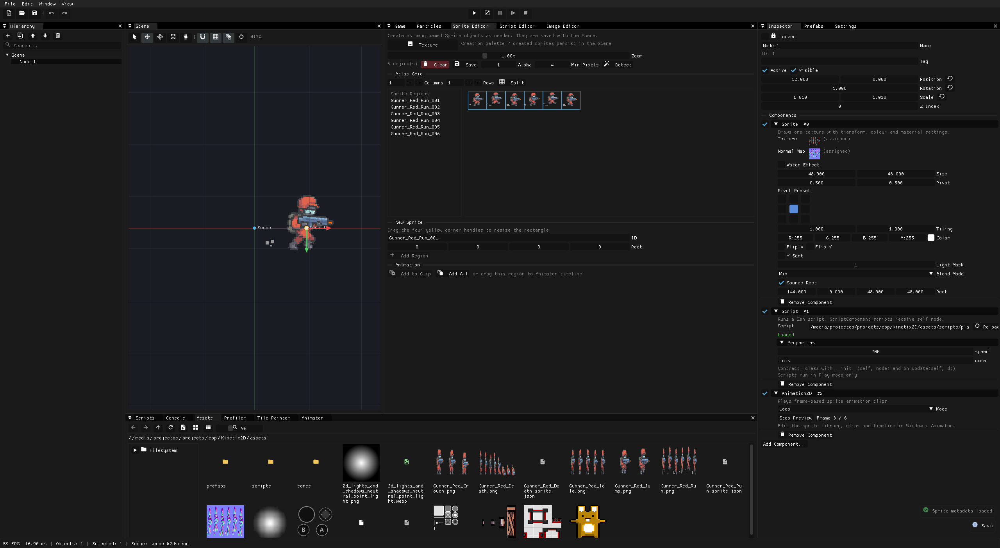
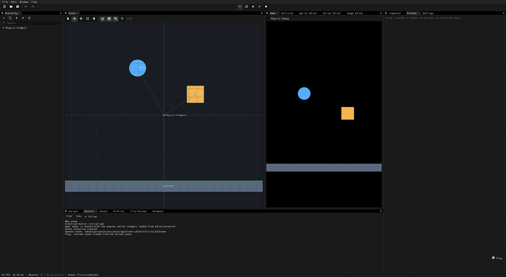

# Kinetix2D

Kinetix2D is a C++ 2D engine and visual editor for making games without giving up direct control of the runtime. It combines a native renderer, physics, scene workflow, asset tools, and ZenScript in one desktop-first project.

  

## Build, edit, play

Create a scene, edit sprites directly from an atlas, build an animation, paint tiles, add physics and scripts, then run the same scene through the editor or runner. The editor is built around dockable panels, scene inspection, live preview, and a project asset browser.

  

## Highlights

| Editor and content tools | Runtime and gameplay |
| --- | --- |
| Scene hierarchy, Inspector, undo/redo, prefabs, themed dockable workspace | Sprite batching, materials, particles, 2D lights, shadows, screen fades, camera effects and parallax |
| Sprite Editor with named regions, atlas detection, grid splitting, pivots and clip export | Native `kx` 2D physics with shapes, collision queries, joints, character movement and tilemap collision |
| Animation timeline, Tile Painter, Image Editor, Script Editor and asset browser | Navigation regions/agents, A* grids, tweens, motion streaks, input actions and virtual mobile controls |
| Screenshot and animated GIF capture directly from the editor | ZenScript game scripting, audio playback, asset packages (`.kpak`) and loose-file development |

## Get Kinetix2D

Download the latest Linux or Windows package from [Releases](https://github.com/akadjoker/Kinetix2D/releases), extract it, and launch the editor:

~~~sh
./bin/k2d_editor
~~~

The runner opens a scene or project independently:

~~~sh
./bin/k2d_runner assets/senes/scene.k2dscene
~~~

### Build from source

Kinetix2D uses CMake, a C++14 compiler, and SDL2.

~~~sh
cmake -S . -B build -DCMAKE_BUILD_TYPE=Release
cmake --build build --parallel
~~~

On Windows, provide SDL2 through vcpkg:

~~~sh
cmake -S . -B build -DCMAKE_BUILD_TYPE=Release \
  -DCMAKE_TOOLCHAIN_FILE="$VCPKG_ROOT/scripts/buildsystems/vcpkg.cmake"
cmake --build build --parallel
~~~

For a local Windows cross-build from Linux, see [tools/dev/build-windows-mingw.sh](tools/dev/build-windows-mingw.sh). It keeps the portable toolchain and vcpkg state under ignored local folders.

## Capture media

The editor can make project media without an external capture tool:

- **F9** saves a full editor-window PNG screenshot.
- **F10** starts or stops a 30 FPS GIF recording.

Both actions are also available from **File**. Captures are written to the editor's current working directory.

## Asset packages

Use `k2d_pack` to ship assets as a compressed package while the runtime continues to use normal logical paths:

~~~sh
./bin/k2d_pack assets game.kpak
./bin/k2d_pack assets game.kpak --key my-key
~~~

Packages use the embedded miniz implementation, so zlib is not required on the host system.

## Project layout

- `engine/` — renderer, editor-facing scene systems, audio, input, assets, navigation and serialization.
- `physics/` — the native `kx` collision and physics library.
- `physics2d/` — game-object components and serialization for `kx` physics.
- `scripting/` — ZenScript VM integration and engine bindings.
- `editor/` — the visual editor and its content tools.
- `runner/` — standalone project and scene runner.
- `tools/k2d_pack/` — `.kpak` package builder.

For deeper references, see [editor documentation](editor/README.md) and [ZenScript documentation](scripting/README.md).

## CI and releases

Every pull request and merge to `master` builds the editor, runner, packer, and KPAK tests on Linux and Windows. These runs validate the change and upload temporary artifacts; they never publish a release.

To publish a release, tag the exact commit you want to ship and push that tag. A `vX.Y.Z` tag runs the same Linux and Windows build against that immutable commit, then publishes both ZIPs to GitHub Releases:

~~~sh
git tag -a v0.2.0 <commit> -m "Kinetix2D v0.2.0"
git push origin v0.2.0
~~~

Use **Actions → CI → Run workflow** with `release_tag` only when you need to rebuild or republish an existing version tag.

## Status

Kinetix2D is actively evolving. The engine, editor and file formats are usable for development, but APIs may change while the workflow is refined.

## License

Kinetix2D is available under the [MIT License](LICENSE). Third-party notices remain with their respective source code.
